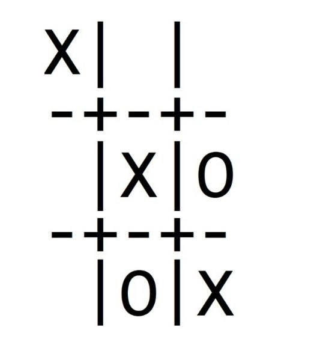

# Tic-Tac-Toe

Tic Tac Toe is a classic programming problem. It can teach  about:
<ul>
  <li>Arrays</li>
  <li>Booleans</li>
  <li>Conditionals</li>
    <li>Functions</li>
  <li>Looping</li>
  <li>Variables</li>
  <li>Data Structures</li>
</ul>  

<h3>Game screen shots<h3>

 

 

 

